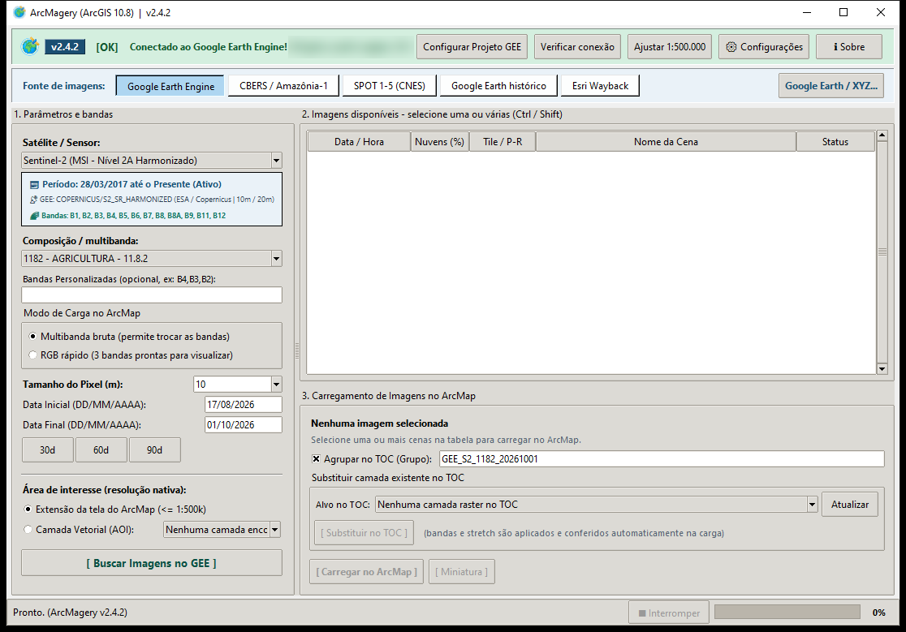

<p align="center">
  
</p>

<h1 align="center">ArcMagery</h1>

<p align="center">
  <strong>Imagens de satélite no ArcGIS Desktop (ArcMap 10.8 / 10.8.2), direto no TOC e na resolução nativa</strong><br>
  <em>Google Earth Engine · Google Earth (atual e histórico) · Esri Wayback · CBERS-4/4A e Amazônia-1 (INPE) · SPOT 1–5 (CNES)</em>
</p>

<p align="center">
  <a href="https://www.esri.com/"></a>
  <a href="https://earthengine.google.com/"></a>
  <a href="https://data.inpe.br/stac/browser/"></a>
  <a href="https://geodes-portal.cnes.fr/"></a>
  <a href="https://www.python.org/"></a>
  <a href="CHANGELOG.md"></a>
  <a href="LICENSE"></a>
  <a href="https://github.com/Yiuky/arcgis-google-earth-engine-explorer/actions/workflows/tests.yml"></a>
</p>

<p align="center">
  <a href="https://github.com/Yiuky/arcgis-google-earth-engine-explorer/releases/latest"><strong>⬇️ Baixar</strong></a> •
  <a href="docs/MANUAL_DE_USO_E_INSTALACAO.md"><strong>📖 Manual</strong></a> •
  <a href="CHANGELOG.md"><strong>📋 Novidades</strong></a> •
  <a href="https://github.com/Yiuky/arcgis-google-earth-engine-explorer/issues/new/choose"><strong>🐞 Relatar problema</strong></a> •
  <a href="#-english-abstract"><strong>🌐 English</strong></a> •
  <a href="#-doe-um-café-para-o-dev"><strong>☕ Doe um café</strong></a>
</p>

---

<p align="center">
  
</p>

## 📌 O que faz

O ArcMagery é um Python Add-In para o **ArcMap 10.8/10.8.2**. Ele busca, recorta e carrega imagens de
satélite direto no TOC, na **resolução nativa**, sem sair do ArcMap e sem downloads manuais. Serve a
quem trabalha com sensoriamento remoto, monitoramento ambiental e perícias.

> Projeto **pessoal e independente** de Joberth Firmino Gambati: não é um produto oficial de nenhuma instituição nem fala em nome dela.

## 🏁 Marco da versão 2.4

A série 2.4 fecha um ciclo: **seis fontes de imagem na mesma janela**, **instalação sem `pip`** e um
plugin que **se diagnostica e se recupera sozinho**.

| | Novidade |
|---|---|
| 🛰️ | **SPOT 1–5 (CNES, 1986–2015)**: 40 anos de histórico de satélite na mesma janela, com cada cena **alinhada automaticamente à Esri World Imagery** (o produto L1A vem com 150–480 m de erro; depois do alinhamento, ~2–5 m) |
| 🩺 | **Diagnóstico com correção automática** no `install.bat` e na tela de abertura: enumera os problemas da máquina, corrige o que é seguro e diz *o que fazer* no resto |
| 📦 | **Earth Engine sem `pip`**: o ArcMagery instala as próprias bibliotecas (versões fixas, SHA-256), funciona atrás de proxy com inspeção SSL e com o Python de qualquer QGIS desde a 3.18 (Python 3.8 a 3.14) |
| 🚦 | **Tela de abertura**: confere Python, GDAL, internet, login do GEE, chave do GEODES e ArcMap antes de abrir |
| 🔀 | **Canais Estável e Experimental (nightly)**, com o selo **EXPERIMENTAL** na interface |
| ↩️ | **Rollback para a versão anterior** com um clique, a partir do backup de cada atualização |

## 🗺️ Fontes de imagens

| Fonte | O que oferece | Resolução |
|---|---|---|
| **Google Earth Engine** | Sentinel-2, Landsat 1–9: cenas, mosaicos por mediana com máscara de nuvem, índices (NDVI, NDWI, NDMI, NBR, EVI, SAVI), matemática de bandas e multibanda completa | 10–60 m |
| **CBERS / Amazônia-1 (INPE)** | STAC do INPE, 32 coleções: CBERS-4A WPM (2 m pan, 8 m multiespectral, fusionada 2 m), MUX, WFI, PAN 5/10 m, Amazônia-1 WFI (Níveis 4 e 2); cubos sem nuvens com NDVI/EVI; histórico CBERS-2/2B (2003–2010); mosaicos | 2–260 m |
| **SPOT 1–5 (CNES)** | Acervo SPOT World Heritage 1986–2015 pelo GEODES: SPOT 1–3 (20 m XS, 10 m PAN), SPOT 4 (20 m XI, 10 m PAN), SPOT 5 (10 m HI, 5 m HM, 2,5 m THR). **Alinhamento automático à Esri.** Busca livre; download com a chave gratuita do GEODES | 2,5–20 m |
| **Google Earth histórico** | As datas do histórico do Google Earth (como no Google Earth Pro), com provedor e cobertura; uma ou várias datas na grade nativa EPSG:4326, até 100 mil tiles | ~0,15–4,8 m |
| **Esri Wayback** | Versões da Esri World Imagery desde 2014, com a **data de captura**, o satélite e a resolução de cada uma | ~0,3–4,6 m |
| **Google Earth / XYZ** | Google Satélite e Híbrido, Esri World Imagery e Clarity, Bing Aerial, costurados num GeoTIFF georreferenciado; na Esri, **data de captura** | até ~0,15 m |

### Destaques
- **Qualidade nativa:** GEE sem reamostragem involuntária; CBERS recortado na grade original da cena por
  leitura parcial HTTP (só a área de interesse é transferida); SPOT na resolução do sensor, em UTM SIRGAS 2000.
- **Áreas extensas:** particionamento automático (GEE > 48 MB, mosaicos com milhares de tiles), com cache e
  retomada após falhas.
- **Área de interesse:** extensão atual do mapa ou camada vetorial (AOI) do TOC; CBERS e SPOT mostram
  quanto da área cada cena **realmente** cobre.
- **Sem travar o ArcMap:** a interface roda em processo próprio; downloads longos não bloqueiam o mapa.
- **Rede corporativa:** tudo usa o repositório de certificados do Windows (proxy com inspeção SSL).
- **Atualização segura:** Release do GitHub verificada por SHA-256, ou arquivo ZIP; backup antes de cada
  mudança e rollback automático se algo falhar.

---

## 💻 Requisitos

| Item | Versão |
|---|---|
| Windows | 10 ou 11 (64-bit) |
| ArcGIS Desktop | 10.8 / 10.8.2 (ArcMap, Python 2.7 em `C:\Python27\ArcGIS10.8`) |
| QGIS | **3.18 ou mais novo** (Python 3.8 a 3.14, 64-bit). O ArcMagery usa o Python dele (GDAL, numpy e Pillow); não é preciso instalar nada com `pip` |
| Google Earth Engine | Conta com Project ID do Google Cloud (só para a fonte GEE) |
| SPOT | Chave de API gratuita do [GEODES](https://geodes-portal.cnes.fr) (só para **baixar** cenas SPOT; a busca é livre) |

## ⚡ Instalação

1. Baixe o `ArcMagery-<versão>.zip` da [última Release](https://github.com/Yiuky/arcgis-google-earth-engine-explorer/releases/latest)
   e extraia numa **pasta de caminho curto** (ex.: `C:\ArcMagery`).
2. Feche o ArcMap e execute **`install.bat`** (não precisa ser administrador). O instalador:
   - encontra o Python do QGIS mais novo (ou o indicado em `GEE_PYTHON3`);
   - roda o **diagnóstico** (`[OK]`, `[CORRIGIDO]`, `[AVISO]`, `[PROBLEMA]` + *o que fazer*) e instala os
     componentes do Earth Engine sem `pip` (~25 MB, ~15 s);
   - empacota e registra o Add-In. Relatório: `%LOCALAPPDATA%\ArcMagery\diagnostico.txt`.
3. Só para o GEE, uma vez: execute **`autenticar_gee.bat`** (abre o navegador para a conta Google).
4. No ArcMap: **Customize › Toolbars › ArcMagery** e clique no botão **ArcMagery**.

Algo deu errado? Veja [Solução de problemas](docs/MANUAL_DE_USO_E_INSTALACAO.md#8-solução-de-problemas)
no manual ou rode `install.bat` de novo: o diagnóstico lista o que falta e como resolver.

## 🚀 Uso rápido

Todas as fontes (menos o XYZ) ficam na mesma janela, na barra **Fonte de imagens**: escolha o
satélite/coleção, a composição, o período e a área, clique em **Buscar**, confira a **Miniatura** e use
**Carregar no ArcMap** (uma ou várias cenas, com fila).

- **Google Earth Engine:** configure o Project ID em **Configurar Projeto GEE**.
- **CBERS / Amazônia-1:** confira a *Cobertura da AOI %* de cada cena. Não exige login.
- **SPOT 1–5 (CNES):** cole a chave em *Configurações › Chave do GEODES (SPOT)* (o botão **Como obter a
  chave** mostra o passo a passo). A imagem entra alinhada à Esri, em falsa cor.
- **Google Earth histórico:** o zoom ocupa o lugar do satélite; cada data é uma linha.
- **Esri Wayback:** cada linha é uma versão da imagem, com a data de captura.
- **Google Earth / XYZ:** botão **Google Earth / XYZ...**; escolha a fonte e o zoom.
- **Desempenho:** *Configurações › Processamento & Sistema* (núcleos e threads de download de tiles).

> ⚠️ **Termos de uso:** cada fonte tem termos próprios. O download em massa de tiles do **Google** (inclusive
> o histórico), do **Bing** e da **Esri** fora das APIs oficiais pode violá-los (para Google e Bing, o
> ArcMagery avisa antes do primeiro uso). Para dados abertos, prefira **CBERS/INPE**, **SPOT/CNES**
> (Etalab 2.0; cite *"SPOT images acquired by CNES's Spot World Heritage Programme"*) e o **Earth Engine**,
> conforme a licença de cada coleção.

## 🔄 Atualizar, canais e rollback

- **Assistente de Atualização** (⚙ Configurações):
  - **Método 1 – Online:** baixa a Release do GitHub e confere o SHA-256. **Canal:** *Estável
    (recomendado)* ou *Experimental (nightly)*, que recebe antes as novidades (versões
    `X.Y.Z-nightly.AAAAMMDD`, com o selo laranja **EXPERIMENTAL**). Para voltar da experimental, escolha
    *Estável* e atualize.
  - **Método 2 – Arquivo ZIP:** instala um pacote baixado manualmente.
  - **Método 3 – Voltar para a Versão Anterior:** reinstala o backup salvo antes da última atualização (o
    mesmo botão desfaz o rollback).
- **Por script:** baixe a nova Release e rode o `install.bat` dela; num clone git, `atualizar.bat` traz o
  branch `main` (desenvolvimento). **Desinstalar:** `desinstalar.bat` (pergunta se remove também os dados).

### Qual arquivo executar

| Arquivo | Para quem | O que faz |
|---|---|---|
| `install.bat` | Usuário | Instala ou reinstala o Add-In, com diagnóstico |
| `autenticar_gee.bat` | Usuário | Login no Google Earth Engine (uma vez) |
| `atualizar.bat` | Usuário (clone git) | Atualiza pelo git e reinstala |
| `desinstalar.bat` | Usuário | Remove o Add-In e, se quiser, os dados |
| `run_tests.bat`, `build_release.py`, `deploy.ps1`, `tools\` | Desenvolvedor | Testes, pacote da Release e utilitários |

## 🏗️ Arquitetura

```text
ArcMap 10.8 (Python 2.7)  ── JSON por sessão (%TEMP%) ──  Interface Tk (pythonw, Python 2.7)
   Add-In, arcpy, TOC                                        │ tela de abertura, janela principal
                                                             │ subprocess --params-file (UTF-8)
                                                             ▼
                  Backend Python 3 = Python do QGIS (GDAL, numpy, Pillow)
                  + %LOCALAPPDATA%\ArcMagery\pylibs\py3XY  (earthengine-api sem pip, SHA-256)
                  gee_core · stac_core (INPE) · spot_core (CNES + alinhamento) · xyz_core · gehist_core
                  esri_core · doctor (diagnóstico) · pylibs
```

Detalhes técnicos, convenções e armadilhas conhecidas estão em [AGENTS.md](AGENTS.md).

## 🧪 Testes

```bat
run_tests.bat                    :: backend (Python 3) + ArcMap/GUI (Python 2.7): ~280 testes
set ARCMAGERY_LIVE=1             :: inclui testes com internet (INPE, Esri, Google, GEODES)
set ARCMAGERY_GEE_PROJECT=<id>   :: inclui teste real no Earth Engine
```

## 📦 Publicar uma versão (mantenedor)

Com a versão atualizada em `config.xml`, `gee_gui.py` e `gee_updater.py`, o selo deste README e a
entrada no `CHANGELOG.md`:

```bat
git tag v2.4.2
git push origin v2.4.2
```

O workflow **Release** gera `ArcMagery-<versão>.zip` e `SHA256SUMS.txt` e publica a Release com as notas do
CHANGELOG. Versões experimentais usam o sufixo `-nightly.AAAAMMDD` e saem como *pre-release*, que o canal
estável nunca instala (detalhes no [AGENTS.md](AGENTS.md)).

## 🤝 Contribuindo

- Como relatar problemas, propor melhorias e enviar código: [CONTRIBUTING.md](CONTRIBUTING.md).
- Arquitetura, regras de Python 2.7 × 3 e armadilhas conhecidas: [AGENTS.md](AGENTS.md).
- Trabalho pendente e prioridades: [BACKLOG.md](BACKLOG.md).
- Vulnerabilidades: siga a [política de segurança](SECURITY.md) (não abra *issue* pública).

## 📝 Como citar

Se o ArcMagery ajudou num trabalho acadêmico ou técnico, use o botão **Cite this repository** do GitHub
(gerado a partir do [CITATION.cff](CITATION.cff)).

---

## 🌐 English Abstract

**ArcMagery** (formerly *ArcGEE Explorer*) is an independent, personal open-source Python Add-In for **ArcGIS Desktop 10.8 / 10.8.2
(ArcMap)** that searches, clips and loads satellite imagery straight into the table of contents, at native
resolution, from six sources in a single window:

- **Google Earth Engine:** Sentinel-2 and Landsat 1–9 scenes, cloud-masked median mosaics, spectral
  indices, band math and full multiband exports.
- **CBERS-4/4A and Amazonia-1:** INPE's STAC catalog, clipped on the native pixel grid via HTTP range reads.
- **SPOT 1–5 (CNES SPOT World Heritage, 1986–2015):** Level 1A scenes georeferenced from the product's own
  location model and **automatically co-registered to Esri World Imagery** by phase correlation (150–480 m
  of native error reduced to ~2–5 m).
- **Google Earth historical imagery**, **Esri Wayback** and **XYZ basemaps**, stitched into georeferenced GeoTIFFs.
- **Zero-pip setup:** the Earth Engine API and its dependencies are installed from hash-pinned wheels using
  the Windows certificate store (works behind TLS-inspecting proxies) on any QGIS Python 3.8–3.14.
- **Self-diagnosis:** the installer and the startup screen enumerate environment problems, fix the safe ones
  and explain the rest. Stable and experimental (nightly) update channels, SHA-256 verified releases, backups
  and one-click rollback.

## ☕ Doe um café para o dev

O ArcMagery é gratuito e de código aberto, desenvolvido nas horas vagas. Se ele economizou o seu tempo, considere pagar um café para o desenvolvedor: ajuda a manter o
projeto vivo e a trazer novas fontes de imagem.

<table>
  <tr>
    <td align="center"></td>
    <td>
      <strong>Pix</strong> (qualquer valor)<br><br>
      Chave aleatória:<br>
      <code>fcf8071f-416d-49f1-b4b9-3188d3d03c4b</code><br><br>
      Pix copia e cola:<br>
      <code>00020101021126580014br.gov.bcb.pix0136fcf8071f-416d-49f1-b4b9-3188d3d03c4b5204000053039865802BR5917JOBERTH F GAMBATI6006CUIABA62070503***63048088</code><br><br>
      <em>Favorecido: Joberth Firmino Gambati</em>
    </td>
  </tr>
</table>

## 👤 Autor e licença

- **Desenvolvedor:** Joberth Firmino Gambati ([@Yiuky](https://github.com/Yiuky))
- **Licença:** [MIT](LICENSE)
- Imagens: © Google, © Esri e parceiros, © Microsoft, CBERS/Amazônia-1 © INPE, SPOT © CNES (Etalab 2.0), e os
  provedores do Google Earth Engine. Respeite as licenças de cada fonte.
