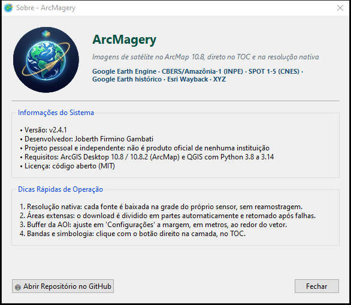

# Manual de Instalação e Operação | ArcMagery

<p align="center">
  
</p>

<p align="center">
  <strong>Google Earth Engine, Google Earth e CBERS/INPE no ArcGIS Desktop (ArcMap 10.8 / 10.8.2)</strong><br>
  <em>Desenvolvido para operações de Sensoriamento Remoto, Geoprocessamento e Fiscalização Ambiental</em><br>
  <strong>Coordenadoria de Geoprocessamento e Monitoramento Ambiental (CGMA / SEMA-MT)</strong>
</p>

---

## 📑 Sumário

1. [Apresentação e Visão Geral](#1-apresentação-e-visão-geral)
2. [Requisitos do Sistema](#2-requisitos-do-sistema)
3. [Configuração da Conta e Projeto no Google Earth Engine](#3-configuração-da-conta-e-projeto-no-google-earth-engine)
4. [Guia de Instalação Passo a Passo](#4-guia-de-instalação-passo-a-passo)
   - [4.1 Instalação Automatizada (Recomendada - 1 Clique)](#41-instalação-automatizada-recomendada---1-clique)
   - [4.2 Instalação Manual](#42-instalação-manual)
   - [4.3 Autenticação Inicial com o Earth Engine](#43-autenticação-inicial-com-o-earth-engine)
5. [Iniciando a Ferramenta no ArcMap](#5-iniciando-a-ferramenta-no-arcmap)
6. [Guia Prático de Operação](#6-guia-prático-de-operação)
   - [6.1 Satélites, Sensores e Períodos Disponíveis](#61-satélites-sensores-e-períodos-disponíveis)
   - [6.2 Composições Coloridas (RGB) e Modo Multibanda Bruta](#62-composições-coloridas-rgb-e-modo-multibanda-bruta)
   - [6.3 Índices Espectrais (NDVI, NDWI, NBR, etc.) e Matemática de Bandas](#63-índices-espectrais-ndvi-ndwi-nbr-etc-e-matemática-de-bandas)
   - [6.4 Filtros Espaciais e Garantia Estrita de Qualidade Nativa 100%](#64-filtros-espaciais-e-garantia-estrita-de-qualidade-nativa-100)
   - [6.5 Busca, Tabela de Resultados e Miniaturas Sob Demanda](#65-busca-tabela-de-resultados-e-miniaturas-sob-demanda)
   - [6.6 Carregamento no TOC, Mosaicos Automáticos e Substituição](#66-carregamento-no-toc-mosaicos-automáticos-e-substituição)
   - [6.7 Painel de Configurações Avançadas (Stretch, DRA e Multicore)](#67-painel-de-configurações-avançadas-stretch-dra-e-multicore)
7. [Atualizações e Manutenção](#7-atualizações-e-manutenção)
8. [Resolução de Problemas Frequentes (FAQ & Troubleshooting)](#8-resolução-de-problemas-frequentes-faq--troubleshooting)
9. [Créditos e Licença](#9-créditos-e-licença)

---

## 1. Apresentação e Visão Geral

O **ArcMagery** é uma extensão oficial (Python Add-In) para **ArcGIS Desktop 10.8 e 10.8.2 (ArcMap)** que integra diretamente o poder de processamento em nuvem do **Google Earth Engine (GEE)** ao ambiente cartográfico da ESRI.

Projetado especialmente para fluxos intensivos de sensoriamento remoto, perícias ambientais e monitoramento de cobertura vegetal da **SEMA-MT**, o plugin elimina a necessidade de exportar imagens para o Google Drive ou baixar gigabytes de cenas completas manualmente. 

### Diferenciais Exclusivos:
* **Garantia de Qualidade Nativa 100%:** Nenhuma imagem baixada sofre reamostragem ou rebaixamento espacial. Os pixels do Sentinel-2 permanecem com 10 metros estritos e os do Landsat com 30 metros.
* **Arquitetura Assíncrona Desacoplada:** A interface opera em um processo isolado (`pythonw.exe`) comunicando-se com o ArcMap por IPC seguro via JSON. O ArcMap **nunca trava ou congela** durante downloads ou consultas pesadas.
* **Multibanda Bruta Completa:** Baixa todas as bandas espectrais em um único arquivo GeoTIFF, permitindo ao usuário alterar a composição RGB diretamente no ArcMap TOC em tempo real sem refazer o download.
* **Índices e Fórmulas em Tempo Real:** Cálculos de NDVI, NDWI, NBR, EVI, SAVI e expressões arbitrárias calculadas na nuvem do Google e baixadas em ponto flutuante (Float32).

---

## 2. Requisitos do Sistema

| Componente | Requisito Mínimo | Observação |
| :--- | :--- | :--- |
| **Sistema Operacional** | Windows 10 ou 11 (64-bit) | Windows Server 2016+ também suportado |
| **ArcGIS Desktop** | ArcMap 10.8 ou 10.8.2 | Requer licença funcional (Basic, Standard ou Advanced) |
| **Python do ArcGIS** | Python 2.7 (32-bit padrão) | Localizado em `C:\Python27\ArcGIS10.8\python.exe` |
| **Python do Backend** | Python 3.9, 3.10, 3.11 ou 3.12 (64-bit) | Pode ser o Python oficial, Anaconda, Miniconda ou Python integrado do QGIS 3.x |
| **Bibliotecas Python 3** | `earthengine-api` e dependências | Instalado automaticamente pelo `install.bat` |
| **Conta Google** | Conta cadastrada no Google Earth Engine | Vinculada a um Google Cloud Project ID |
| **Acesso à Rede** | Conexão com a Internet | Acesso livre a `*.googleapis.com` e `earthengine.googleapis.com` |

---

## 3. Configuração da Conta e Projeto no Google Earth Engine

Para utilizar a API do Google Earth Engine, é necessário ter uma conta de acesso e um ID de Projeto no Google Cloud (gratuito para fins não comerciais, ambientais e acadêmicos).

### Passo a Passo para Obter o ID do Projeto:
1. Acesse o portal do Earth Engine: [https://earthengine.google.com/signup/](https://earthengine.google.com/signup/) ou faça login no [Google Earth Engine Code Editor](https://code.earthengine.google.com/).
2. Ao acessar pela primeira vez, o Google solicitará a escolha ou criação de um **Google Cloud Project**.
3. Escolha **"Unpaid commercial / Academic / Government"** ou **"Non-commercial"** e selecione ou crie um projeto (ex: `ee-meu-usuario` ou `projeto-monitoramento-ambiental`).
4. Anote o **Project ID** gerado (ex: `ee-meunome` ou `earth-engine-351813`). Esse ID será inserido no plugin.

> [!TIP]
> Você pode consultar e gerenciar seus projetos do Google Cloud a qualquer momento pelo console: [https://console.cloud.google.com/](https://console.cloud.google.com/).

---

## 4. Guia de Instalação Passo a Passo

<p align="center">
  
</p>

### 4.1 Instalação Automatizada (Recomendada - 1 Clique)

O repositório conta com um instalador completo para Windows (`install.bat`) que automatiza todo o processo de preparação:

1. **Baixe ou clone o repositório:**
   ```cmd
   git clone https://github.com/Yiuky/arcgis-google-earth-engine-explorer.git
   ```
   *(Caso tenha baixado em formato `.zip`, extraia o conteúdo em uma pasta de sua escolha, por exemplo `C:\ArcMagery`)*.
2. Certifique-se de que o **ArcMap esteja fechado**.
3. Dê um duplo clique no arquivo **`install.bat`**.
4. O script executará as seguintes ações:
   - Detectará a instalação do ArcGIS Desktop 10.8 e seu Python 2.7.
   - Criará um ambiente Python 3 **isolado** em `%LOCALAPPDATA%\ArcMagery\venv`, a partir do Python do QGIS 3.x (preferido, pois já traz o GDAL usado no CBERS) ou de um Python 3.10+ oficial. O QGIS e outros projetos não são alterados.
   - Instalará `earthengine-api`, Pillow e numpy nesse ambiente e conferirá se o GDAL está disponível.
   - Empacotará o Add-In `.esriaddin` e o registrará no utilitário ESRI oficial (`ESRIRegAddIn.exe`).
   - Limpará caches de bytecode residuais (`AssemblyCache`), garantindo inicialização limpa.
   - Copiará os templates de simbologia e disponibilizará a caixa de ferramentas `GEE_Tools.pyt`.
5. Ao finalizar, pressione qualquer tecla para fechar o instalador.

---

### 4.2 Instalação Manual

Caso você trabalhe em uma rede corporativa com restrições de execução de scripts `.bat`:

1. **Instalar dependências no seu Python 3:**
   Abra o prompt de comando do seu Python 3 e execute:
   ```cmd
   pip install earthengine-api
   ```
2. **Instalar o Add-In no ArcMap:**
   - Navegue até a subpasta `arcgis_addin`.
   - Dê um duplo clique no arquivo **`GEE_Image_Selector.esriaddin`**.
   - Na janela do utilitário da ESRI (*Esri ArcGIS Add-In Installation Utility*), clique em **Install Add-In**.
   - Será exibida a mensagem: *"Installation succeeded"*.

---

### 4.3 Autenticação Inicial com o Earth Engine

Antes de fazer a primeira consulta, é preciso vincular o token do Google Earth Engine no seu perfil de usuário do Windows:

1. Dê um duplo clique no arquivo **`autenticar_gee.bat`** (localizado na raiz do repositório).
   *(Alternativamente, você pode clicar no botão **"Autenticar GEE"** na janela do plugin dentro do ArcMap)*.
2. Seu navegador de internet padrão será aberto automaticamente na página de autorização do Google.
3. Faça login com a sua conta Google cadastrada no Earth Engine.
4. Conceda as permissões de acesso à API do Google Earth Engine.
5. O navegador confirmará a autorização e o token persistente será salvo em `%USERPROFILE%\.config\earthengine\credentials`.

> [!NOTE]
> Essa autenticação precisa ser feita **apenas uma vez** por máquina/usuário. O token permanecerá válido continuamente.

---

## 5. Iniciando a Ferramenta no ArcMap

1. Abra o **ArcMap 10.8** ou **10.8.2**.
2. Caso a barra de ferramentas não apareça na inicialização:
   - Vá ao menu superior do ArcMap: **Customize** > **Toolbars**.
   - Marque a opção **`ArcMagery`** (ou `GEE Image Selector`).
3. Uma barra flutuante será exibida contendo o botão oficial do plugin com o ícone do satélite:
   
   <p align="center">
     <strong>[ 🛰️ ArcMagery ]</strong>
   </p>

4. Clique no botão. A interface do **ArcMagery** abrirá instantaneamente em uma janela moderna independente.
5. **Configurar o Projeto GEE:**
   - No cabeçalho da janela, verifique o status de conexão.
   - Caso esteja em amarelo solicitando o projeto, clique em **`[ Configurar Projeto GEE ]`**.
   - Cole o ID do seu projeto Google Cloud (ex: `ee-meuprojeto`).
   - O indicador ficará verde:  
     `[OK] Conectado ao Google Earth Engine! (Projeto: ee-meuprojeto)`.

---

## 6. Guia Prático de Operação

<p align="center">
  
</p>

### 6.1 Satélites, Sensores e Períodos Disponíveis

O plugin dá suporte a todo o acervo histórico e contemporâneo das missões Sentinel e Landsat. Ao selecionar qualquer satélite no menu suspenso, a interface exibe dinamicamente o intervalo de datas operacionais e a resolução nativa:

| Satélite / Sensor | Coleção Earth Engine | Resolução Nativa | Período Operacional de Dados |
| :--- | :--- | :--- | :--- |
| **Sentinel-2 (Harmonized MSI)** | `COPERNICUS/S2_SR_HARMONIZED` | **10 metros** (B2, B3, B4, B8) | **23/06/2015 até o presente** |
| **Landsat 9 (OLI-2/TIRS-2)** | `LANDSAT/LC09/C02/T1_L2` | **30 metros** | **31/10/2021 até o presente** |
| **Landsat 8 (OLI/TIRS)** | `LANDSAT/LC08/C02/T1_L2` | **30 metros** | **11/04/2013 até o presente** |
| **Landsat 7 (ETM+)** | `LANDSAT/LE07/C02/T1_L2` | **30 metros** | **28/05/1999 até o presente** *(SLC-off após 31/05/2003)* |
| **Landsat 5 (TM)** | `LANDSAT/LT05/C02/T1_L2` | **30 metros** | **16/03/1984 a 05/05/2012** *(Período histórico)* |
| **Landsat 4 (TM)** | `LANDSAT/LT04/C02/T1_L2` | **30 metros** | **22/08/1982 a 14/12/1993** *(Período histórico)* |
| **Landsat 1 a 5 (MSS)** | `LANDSAT/LM01-05/C02/T1` | **60 metros** | **23/07/1972 a 06/01/1999** *(Pioneiro)* |

---

### 6.2 Composições Coloridas (RGB) e Modo Multibanda Bruta

O plugin disponibiliza as combinações de bandas mais utilizadas internacionalmente pela comunidade de sensoriamento remoto:

* **Cor Natural (True Color):** RGB padrão (Vermelho, Verde, Azul). Ideal para interpretação visual direta, inspeção urbana e validação em solo.
* **Agricultura / Vigor Vegetativo:** Combina bandas do infravermelho próximo e ondas curtas (ex: 11-8-2 no Sentinel-2 ou 6-5-2 no Landsat). Realça safras agrícolas e culturas irrigadas em tons verdes brilhantes e solo exposto em magenta/marrom.
* **Falsa Cor Infravermelho (Color Infrared):** Vegetação densa e saudável em vermelho vivo, água em tons escuros/negros e áreas degradadas em ciano.
* **SWIR / Geologia & Solos:** Excelente para diferenciação mineralógica, umidade do solo e penetração através de fumaça e bruma atmosférica.

#### Modos de Carga:
* **Multibanda Bruta (Recomendado):** Baixa todas as bandas espectrais nativas em um único GeoTIFF (ex: 10 bandas no Sentinel-2). Permite ao operador alternar as bandas no ArcMap clicando com o botão direito na camada (`Layer Properties` > `Symbology`) sem necessidade de fazer um novo download.
* **RGB Rápido:** Baixa um arquivo leve contendo estritamente as 3 bandas da composição selecionada.

---

### 6.3 Índices Espectrais (NDVI, NDWI, NBR, etc.) e Matemática de Bandas

Além das composições multiespectrais, o ArcMagery calcula índices biofísicos diretamente nos servidores do Google Earth Engine, baixando uma camada monocamada Float32 pronta com rampa de cores automática:

* **NDVI (Normalized Difference Vegetation Index):** Mede o vigor fotossintético e biomassa vegetal:
  $$\text{NDVI} = \frac{\text{NIR} - \text{RED}}{\text{NIR} + \text{RED}}$$
* **NDWI (Normalized Difference Water Index):** Destaque de corpos hídricos, represas, rios e áreas alagadas:
  $$\text{NDWI} = \frac{\text{GREEN} - \text{NIR}}{\text{GREEN} + \text{NIR}}$$
* **NDMI (Normalized Difference Moisture Index):** Monitoramento do conteúdo de água e estresse hídrico no dossel foliar:
  $$\text{NDMI} = \frac{\text{NIR} - \text{SWIR1}}{\text{NIR} + \text{SWIR1}}$$
* **NBR (Normalized Burn Ratio):** Detecção e severidade de queimadas e cicatrizes de fogo:
  $$\text{NBR} = \frac{\text{NIR} - \text{SWIR2}}{\text{NIR} + \text{SWIR2}}$$
* **EVI (Enhanced Vegetation Index) & SAVI:** Índices com correção de aerossóis e efeito do substrato do solo.

#### Matemática de Bandas Customizada (Custom Band Math):
Selecione a opção **"Fórmula Personalizada (Band Math)"** e digite qualquer expressão na caixa de texto.
- Exemplo Sentinel-2: `(B8 - B4) / (B8 + B4)` ou `(B8 - B11) / (B8 + B11)`
- Exemplo Landsat 8/9: `(SR_B5 - SR_B4) / (SR_B5 + SR_B4)`

---

### 6.4 Filtros Espaciais e Garantia Estrita de Qualidade Nativa 100%

<p align="center">
  
</p>

O plugin disponibiliza dois métodos principais para definir a região de interesse:

1. **Extensão da Tela do ArcMap (Display Extent):**
   - Utiliza a coordenada visual atual do seu Data Frame no ArcMap.
   - O plugin valida automaticamente a escala. Para garantir a resolução nativa de 10m no Sentinel-2 ou 30m no Landsat, recomenda-se uma escala de **1:250.000 ou menor** (ex: 1:100.000, 1:50.000).
   - Use o botão **`[ Ajustar 1:500.000 ]`** na barra superior para enquadrar a escala segura com 1 clique.

2. **Camada Vetorial (AOI do TOC):**
   - Lista automaticamente todas as camadas vetoriais (Shapefiles, Feature Classes de Geodatabase) abertas na Tabela de Conteúdos do ArcMap.
   - Ao selecionar uma camada vetorial (ex: limite de uma fazenda, terra indígena, unidade de conservação ou imóvel CAR), o plugin recorta **exatamente o polígono** da área de estudo.
   - **Buffer Envolvente de Segurança:** O plugin aplica automaticamente uma margem de proteção (padrão de 1.000 metros, configurável) ao redor do vetor para assegurar que nenhum pixel de borda seja cortado.

> [!TIP]
> **Suporte a Downloads de Áreas Extensas (> 48 MB - Novidade v1.6):**
> O Google Earth Engine possui um teto unitário de 48 MB por requisição. A partir da versão 1.6, o ArcMagery particiona automaticamente áreas extensas (em escalas de até 1:500.000 ou grandes polígonos AOI) em uma grade de quadrantes seguros, baixados em paralelo multithread e mesclados continuamente via GDAL, garantindo **100% da resolução espacial nativa** (10m no Sentinel-2, 30m no Landsat) sem cancelamentos ou perdas de dados.

---

### 6.5 Busca e Tabela de Resultados

1. Defina a **Data Inicial** e a **Data Final** utilizando o formato brasileiro (`DD/MM/AAAA`) ou os atalhos rápidos (`30d`, `60d`, `90d`).
2. Ajuste o controle deslizante de **Cobertura Máxima de Nuvens** (ex: até 20%).
3. Clique em **`[ Buscar Imagens no GEE ]`**.
4. A tabela listará todas as passagens disponíveis com:
   - **Data / Hora:** Registro exato da passagem orbital.
   - **Nuvens (%):** Cobertura estimada de nebulosidade sobre a cena.
   - **Tile / P-R:** Identificador do tile MGRS (Sentinel-2) ou Path/Row (Landsat).
   - **Nome da Cena:** Identificador oficial completo no acervo do Earth Engine.
   - **Status:** Indicador de cenas já carregadas no ArcMap.

---

### 6.6 Carregamento no TOC e Substituição de Camadas

Com uma ou mais imagens selecionadas na grade:

* **`[ Carregar no ArcMap ]`**:
  Baixa a cena selecionada com 100% de resolução nativa (particionando automaticamente se exceder 48 MB), projeta para as coordenadas do mapa e insere o raster na Tabela de Conteúdos (**TOC**) do ArcMap com **renderização nativa RGB Composite** (`IRasterRGBRenderer`), abrindo os canais Red, Green e Blue no TOC.
* **`[ Substituir no TOC ]`**:
  Atualiza uma camada raster previamente carregada, substituindo seus dados pela nova data sem bagunçar a ordem das camadas no mapa.
* **Simbologia garantida na carga (v2.2):** toda imagem entra no TOC exatamente como foi pedida e
  configurada. Imagens multibanda entram em **RGB Composite com as bandas escolhidas**; imagens de
  uma banda (índices, pancromática) entram em **Stretched**. O **Stretch** das Configurações
  (tipo, nº de desvios padrão e origem das estatísticas/DRA) é gravado na camada e **conferido
  depois de inserida**. Se algo não puder ser garantido, um aviso é exibido; a camada nunca
  entra "errada em silêncio". Por isso os antigos botões *Composição*, *Forçar RGB* e
  *Garantir Stretch* foram removidos.

---

### 6.7 Painel de Configurações Avançadas (v1.7)

Clique no botão **`[ ⚙ Configurações ]`** no canto superior direito para acessar as preferências do sistema, organizadas em abas limpas e com botões de ação fixados na base:

#### Aba 1: Visualização & TOC
1. **Métodos de Realce (Stretch):**
   - **Standard Deviations (Desvio Padrão):** Padrão industrial para sensoriamento remoto (ex: `2.0` desvios padrão).
   - **Dynamic Range Adjustment (DRA):** Realce dinâmico em tempo real ajustado à extensão visível na tela.
   - **Percent Clip:** Realce cortando extremos do histograma. Os percentuais de corte seguem o padrão do
     ArcMap (*Customize › ArcMap Options › Raster › Raster Dataset*); o ArcObjects 10.8 não permite
     defini-los por camada.
   - O botão **Aplicar e Garantir Stretch Atual nas Camadas do ArcMap** reaplica o stretch a todas as
     camadas raster do mapa, **preservando a combinação de bandas** de cada uma.
   - **Minimum-Maximum:** Distribui o contraste entre os valores absolutos mínimo e máximo.
2. **Visualização de Camadas no TOC (Novidade v1.7):**
   - **Ativado:** As imagens entram marcadas (`[x]`) e desenhadas no mapa.
   - **Desativado:** As imagens entram desmarcadas (`[ ]`), ideal para carregar lotes de cenas pesadas sem congelar a renderização da tela.

#### Aba 2: Processamento & Sistema
1. **Desempenho e Aceleração Multicore:**
   - Ativação de downloads paralelos e aceleração de estatísticas/pirâmides no ArcMap.
2. **Margem de Buffer da AOI:**
   - Define a margem extra em metros ao redor do retângulo envolvente do vetor (padrão: 1.000m).
3. **Atualização do Plugin:**
   - Acesso direto ao assistente integrado de atualização remota via GitHub ou arquivo ZIP local (processo desacoplado v1.8 sem travas de arquivos).

---

### 6.8 Bandas Personalizadas e Informações do Sensor (v1.8)

1. **Quadro Informativo do Sensor:**
   - O painel azul na coluna lateral exibe dinamicamente o período de operação, a coleção oficial do GEE e a listagem de todas as bandas disponíveis para o satélite selecionado (ex: `B1 a B12` no Sentinel-2, `SR_B1 a SR_B7, ST_B10` no Landsat).
2. **Bandas Personalizadas Resilientes:**
   - Ao selecionar a opção **`CUSTOM_BANDS - BANDAS PERSONALIZADAS`** ou digitar diretamente na caixa de texto bandas separadas por vírgula (ex: `B4,B3,B2` ou `B8,B4,B3`), o plugin baixa as bandas brutas em 100% da resolução nativa e as projeta diretamente como uma composição RGB Composite `(0, 1, 2)` no TOC do ArcMap.
   - O backend realiza auto-detecção de satélite a partir da cena e tradução cruzada de nomenclaturas (ex: `SR_B5` $\leftrightarrow$ `B5`).

---

### 6.9 Validação Atômica de Raster e Health Check Pós-Processamento (v1.10)

1. **Garantia Multibanda Sem Colapso (4+ Bandas):**
   - Suporte estrito a composições com qualquer número de bandas (ex: 4 bandas no Landsat 5: `SR_B3, SR_B4, SR_B5, SR_B7` ou `B3-B5, B7`), inclusive delimitadas por parênteses `(SR_B3, ...)` ou colchetes.
   - O pipeline impede a conversão acidental para índice monobanda e assegura que todas as bandas solicitadas sejam baixadas do GEE e preservadas nos mosaicos GDAL.
2. **Inspeção Atômica Pré-TOC (`validate_geotiff_health`):**
   - Antes de adicionar qualquer arquivo ao mapa, o plugin inspeciona a contagem física de bandas, dimensões espaciais, resolução, CRS e integridade estatística dos pixels.
   - Rasters com desvio padrão zero, flat-zero ou NoData integral (all-NaN) são sumariamente rejeitados e excluídos do disco com geração de logs estruturados em JSON, impedindo que dados defeituosos corrompam sessões de trabalho no ArcMap.
3. **Simbologia RGB Dinâmica no ArcMap:**
   - Para rasters com 3 ou mais bandas, o ArcObjects vincula automaticamente o `IRasterRGBRenderer` atualizado com as bandas iniciais, garantindo renderização colorida em tela sem recorrer à escala de cinza padrão da Banda 1.

---

### 6.10 Fontes de imagens: GEE, CBERS / Amazônia-1 e Google Earth (v2.1)

Logo abaixo da barra superior fica a barra **Fonte de imagens**:
* **Google Earth Engine (Sentinel-2 / Landsat):** o fluxo descrito nas seções 6.1 a 6.9.
* **CBERS / Amazônia-1 (INPE):** usa a **mesma janela e o mesmo fluxo** (veja abaixo).
* **Google Earth / Mosaicos XYZ...:** abre uma janela própria (veja abaixo).

#### Google Earth / Mosaicos XYZ
A janela tem a **Área de interesse** (extensão atual do ArcMap ou camada vetorial AOI) e a
**Pasta de saída**.
1. Escolha a **Fonte**: Google Earth / Satélite, Google Híbrido, Esri World Imagery, Esri Clarity ou Bing Aerial.
2. Ajuste o **Zoom**. A estimativa aparece na hora: quantidade de tiles, dimensões, m/pixel no
   terreno e volume de download (zoom 18 ≈ 0,57 m/pixel; zoom 19 ≈ 0,29 m/pixel em MT).
3. Opcional: compressão LZW (sem perdas) e reprojeção para SIRGAS 2000 (EPSG:4674). Por padrão
   o mosaico fica em Web Mercator (EPSG:3857) nativo, sem reamostragem.
4. Clique em **Baixar mosaico e carregar no ArcMap**. A camada entra no grupo
   `ArcMagery - Google Earth / XYZ`.

* **Data das imagens (Esri):** com a fonte *Esri World Imagery*, o quadro **Data das imagens** mostra:
  * **Consultar datas desta área:** a data de captura de cada parte da área, com satélite, fornecedor,
    resolução e cobertura (%), e o **histórico Wayback**, isto é, as datas anteriores em que a imagem
    daquele local mudou. A consulta leva cerca de 20 s na primeira vez e depois vem do cache por 24 h.
  * **Imagem:** escolha "Mais recente" ou uma data de captura do histórico e baixe aquela imagem.
  * **Carregar também os polígonos com as datas de captura:** insere, acima do mosaico, os polígonos
    de cada data com rótulo "data satélite", como a "Data das imagens" do Google Earth Pro.
  * A data de captura também vai no **nome da camada** e nos metadados do GeoTIFF.
  * Para **Google e Bing** não há API pública com a data das imagens; a janela informa isso.
* **Limite de segurança:** 20.000 tiles por download. Reduza a área ou o zoom se ele for atingido.
* **Retomada:** se a rede cair, os tiles já baixados ficam em `<arquivo>_tiles`. Repita o
  download e só os tiles que faltam serão buscados.
* **Termos de Uso:** para Google e Bing, um aviso é exibido antes do primeiro download. O uso em
  massa fora das APIs oficiais viola os Termos de Serviço desses provedores. Prefira a Esri ou o
  CBERS para uso institucional.

#### CBERS / Amazônia-1 (INPE), na janela principal
Selecione **CBERS / Amazônia-1 (INPE)** na barra *Fonte de imagens*. A janela se adapta:
* **Satélite / Sensor** passa a listar as coleções do INPE, e **Composição** passa a listar os
  produtos. Os campos exclusivos do GEE (bandas personalizadas, modo de carga e tamanho do pixel)
  ficam desabilitados, porque o recorte é sempre na grade nativa da cena.
* Não é preciso estar conectado ao Google Earth Engine.

1. Escolha a **coleção** em *Satélite / Sensor*:

   | Coleção | Resolução | Produtos |
   |---|---|---|
   | CBERS-4A WPM | 8 m (MS) e 2 m (PAN) | cor natural, falsa cor, multibanda, pancromática |
   | CBERS-4A WPM fusionada (PCA) | 2 m | RGB fusionado |
   | CBERS-4/4A MUX | 16–20 m | cor natural, falsa cor, multibanda |
   | CBERS-4/4A WFI e Amazônia-1 WFI | 55–64 m | cor natural, falsa cor, multibanda |
   | CBERS-4 PAN 10 m / 5 m | 10 m / 5 m | falsa cor e multibanda / pancromática |

2. Escolha o **produto** em *Composição* e informe o **período** e a **área**, como no GEE.
3. Clique em **Buscar Cenas no INPE**. A coluna *Órbita/Ponto · Cobertura* mostra quanto da área
   cada cena cobre de fato; cenas que não cobrem a área são omitidas. Coleções DN não informam
   nuvens (`n/d`).
4. Selecione uma ou mais cenas e use **[ Miniatura ]** para inspecionar. Clique em
   **[ Carregar no ArcMap ]**: as cenas entram na fila de download, e o "Substituir no TOC" e o
   agrupamento também funcionam.

* **Somente o recorte é transferido:** o ArcMagery lê por HTTP apenas a janela de pixels da
  área, na grade e resolução **nativas** da cena (UTM/WGS84), sem reamostragem.
* Os valores são DN ou refletância de superfície (SR), conforme a coleção. O multibanda mantém
  a ordem espectral (azul, verde, vermelho, NIR) e é exibido em cor natural.
* **Requisito:** GDAL no Python 3 do backend. O `install.bat` o obtém do QGIS 3.x.

---

## 7. Atualizações e Manutenção

O ArcMagery conta com uma arquitetura de atualização **transacional e à prova de falhas** (módulo `gee_updater.py`):

<p align="center">
  
</p>

### 🛡️ Princípios de Confiabilidade do Atualizador:
1. **Validações Prévias Rígidas (Pre-flight Checks):**
   - **Para GitHub / Git:** Testa conectividade de rede com timeout, valida se o branch remoto existe, verifica permissões de escrita e inspeciona o status do repositório local. Se houver alterações locais não salvas (*dirty working tree*) ou divergência de commits, a atualização é interrompida com orientações claras para evitar conflitos de merge ou perda de código.
   - **Para Arquivo .ZIP:** Executa verificação física CRC-32 de todos os blocos compactados (`testzip`), proteção contra ataques **Zip Slip / Path Traversal** (bloqueio de referências `..` e dispositivos do Windows), validação de componentes essenciais (`config.xml`, `gee_gui.py`, `gee_bridge.py`, `gee_core.py`) e cálculo rigoroso de espaço livre em disco ($3\times$ descompactado + 50 MB de margem de segurança).
2. **Snapshot de Backup e Retenção Automática:**
   - Antes de modificar qualquer arquivo, o sistema cria um snapshot completo da instalação em `%LOCALAPPDATA%\CGMA_ArcGEE\backups\backup_<versao>_<data>`, salvando o `.esriaddin`, o `AssemblyCache` e um manifesto com hashes SHA-256. Uma política de retenção mantém os 5 backups mais recentes.
3. **Staging Isolado e Transação Desacoplada:**
   - A preparação ocorre em diretório temporário isolado (`%TEMP%\arcgee_stage_*`).
   - A aplicação é delegada a um runner em lote desanexado (`apply_arcgee_update_*.bat`), contornando o travamento de arquivos de processos em execução no Windows (`WinError 32 / Acesso Negado`).
4. **Rollback Automático Instantâneo:**
   - Se ocorrer erro em qualquer etapa da cópia ou no *smoke test* pós-instalação, o script reverte automaticamente a instalação para o backup funcional anterior, recompila os binários `.pyc` e notifica o usuário via pop-up nativo.
5. **Logs Estruturados e Feedback Amigável:**
   - Mensagens de erro contam com diagnósticos em português, causas e passos práticos de solução, enquanto logs detalhados e *tracebacks* são salvos em `%LOCALAPPDATA%\CGMA_ArcGEE\logs\arcgee_updater.log`.

### Formas de Atualizar:
1. **Pela Interface Gráfica:**
   - Acesse **Configurações (⚙)** > clique em **`[ 🔄 Abrir Assistente de Atualização (GitHub / ZIP) ]`**.
   - Escolha **"Atualizar Diretamente via GitHub"**. O pacote vem da **última Release publicada** e só é instalado se o hash SHA-256 conferir com o `SHA256SUMS.txt` da Release. Se ainda não houver Release, o assistente pergunta se você aceita baixar a versão de desenvolvimento do branch `main` **sem verificação**. Downgrades também exigem confirmação.
   - Ou escolha **"Selecionar Arquivo ZIP e Atualizar"** para pacotes manuais offline.
2. **Por Linha de Comando:**
   - Feche o ArcMap e execute o arquivo **`install.bat`** ou **`deploy.ps1`** na raiz da pasta do plugin.


### Como Desinstalar:
- Para remover o plugin por completo de forma limpa, feche o ArcMap e dê um duplo clique em **`desinstalar.bat`**. O script encerra processos residuais, desinstala o arquivo `.esriaddin` e limpa o diretório de cache do ArcGIS.

---

## 8. Resolução de Problemas Frequentes (FAQ & Troubleshooting)

### 1. "Aviso: A escala atual do ArcMap é maior que 1:500.000"
* **Causa:** Escalas muito afastadas (ex: 1:1.000.000 ou visão do estado inteiro) cobrem centenas de milhares de quilômetros quadrados, ultrapassando os limites físicos de memória da máquina e da API do GEE.
* **Solução:** Aproxime o zoom no ArcMap para a sua área de trabalho real (escala recomendada entre 1:50.000 e 1:250.000) ou clique no botão **`[ Ajustar 1:500.000 ]`** na barra superior da janela.

### 2. "Como funciona o download de imagens com tamanho superior a 48 MB?"
* **Comportamento v1.6:** O plugin conta com o algoritmo de *Smart Spatial Tiling*. Se a tela ou vetor demandar mais de 48 MB na resolução nativa (ex: uma tela inteira a 1:500.000 gerando 80 MB ou 200 MB), o backend divide a requisição em sub-quadrantes de até 32 MB cada, realiza os downloads concorrentes e os mescla de forma contínua em um GeoTIFF único com GDAL. O processo é 100% transparente para o usuário!

### 3. O botão na barra do ArcMap foi clicado, mas a janela não abre
* **Causa 1:** O interpretador Python 3 não possui a biblioteca `earthengine-api` instalada.
  - *Solução:* Execute o arquivo `install.bat` novamente ou instale manualmente via `pip install earthengine-api`.
* **Causa 2:** Cache de arquivos compilados antigos (`.pyc`) no diretório do ArcGIS.
  - *Solução:* Execute `desinstalar.bat` e em seguida `install.bat` para regenerar o cache limpo.

### 4. "Invalid GeoJSON geometry" ao filtrar por camada vetorial
* **Causa:** O polígono selecionado possui auto-interseções, anéis desconectados ou está em uma projeção cartográfica corrompida.
* **Solução:** A partir da versão 1.4.1, o plugin sanitiza e reprojeta a geometria automaticamente para WGS84 (EPSG:4326). Certifique-se de estar utilizando a versão 1.5.

### 5. Como forçar um Python 3 específico?
* Caso você tenha múltiplos ambientes Python 3 (ex: Anaconda, QGIS, ArcGIS Pro) e queira definir manualmente qual deles deve executar o backend do GEE, crie a variável de ambiente do Windows `GEE_PYTHON3`:
  ```cmd
  setx GEE_PYTHON3 "C:\MeuPython3\python.exe"
  ```
* Por padrão o plugin usa, nesta ordem: `GEE_PYTHON3`, o caminho salvo nas configurações, o venv
  `%LOCALAPPDATA%\ArcMagery\venv` e, por fim, outros Pythons 3 que tenham o `earthengine-api`. Para CBERS
  e Google Earth, é escolhido um Python 3 com GDAL (venv do ArcMagery ou QGIS).

### 6. CBERS: "Erro SSL" ou "HTTP response code 0" em rede corporativa
* O ArcMagery exporta os certificados do Windows (incluindo a CA do proxy corporativo) para
  `%TEMP%\arcmagery_ca_bundle.pem` e os entrega ao GDAL. Se ainda falhar, defina a variável
  `CURL_CA_BUNDLE` apontando para o arquivo `.pem` fornecido pela equipe de TI.

### 8. Onde ficam os registros (logs) para suporte?
* O ArcMap usa uma pasta temporária própria por sessão: `%LOCALAPPDATA%\Temp\arcXXXX\arcgee_debug.log`
  (ex.: `arc86DA`). Use a pasta `arc....` mais recente. Cada imagem carregada registra a linha
  `Simbologia conferida (...)` ou o motivo de um aviso.

### 7. CBERS: "A área de interesse cai fora da parte imageada da cena"
* A cena cobre o retângulo, mas não a parte com imagem (bordas NoData de cenas inclinadas).
  Escolha outra cena com **Cobertura da AOI %** próxima de 100.

---

## 9. Créditos e Licença

* **Desenvolvedor:** Joberth Firmino Gambati
* **Instituição:** Coordenadoria de Geoprocessamento e Monitoramento Ambiental (CGMA)  
  *Secretaria de Estado de Meio Ambiente de Mato Grosso (SEMA-MT)*
* **Repositório Oficial:** [https://github.com/Yiuky/arcgis-google-earth-engine-explorer](https://github.com/Yiuky/arcgis-google-earth-engine-explorer)
* **Licença:** Código aberto distribuído sob a licença [MIT](LICENSE). Permitido o uso livre para fins governamentais, acadêmicos e comerciais.
